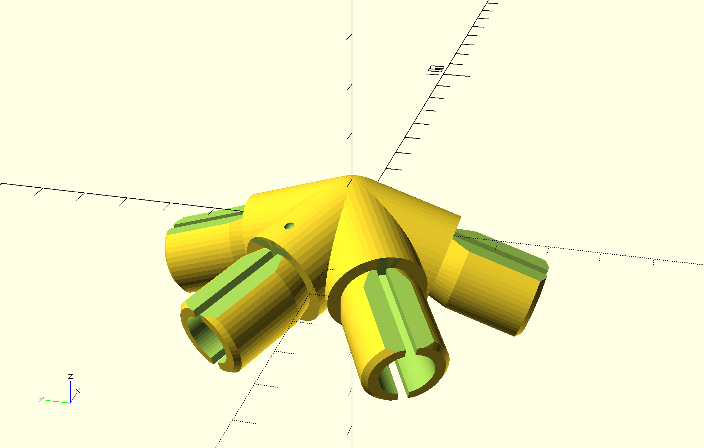
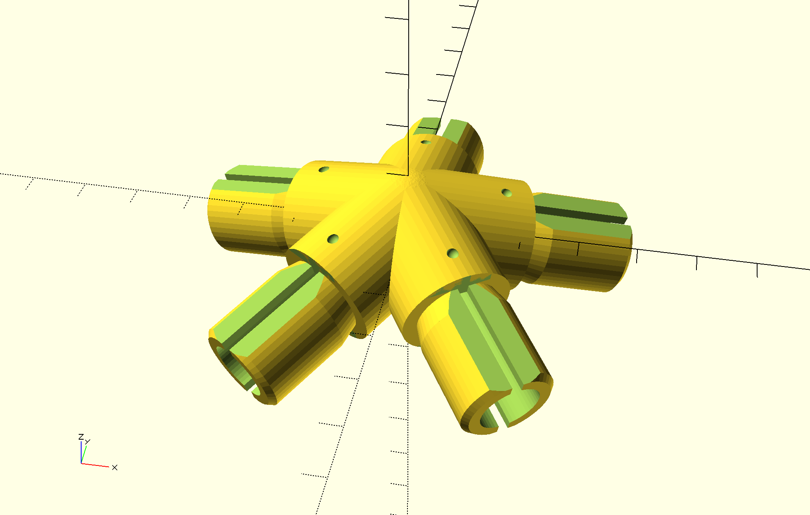
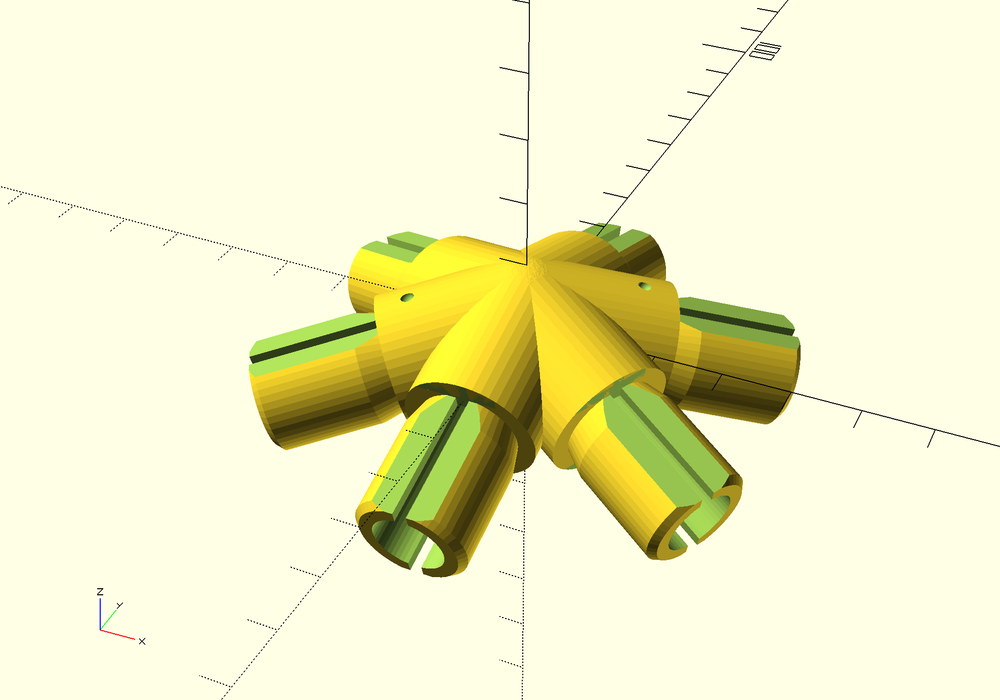

# domehome
A DIY dome garden house!

Dome shaped houses are nothing new, there's plenty of stuff about them out there. The idea with this project is that with the help of a 3D printer and cheap aluminium tubes you should be able to get something sturdy and easy-to-assemble without spending a fortune.

This particular design is for "2V 1/2 geodesic dome". I'm using 20x1.5mm aluminium tubes (meaning that the inner diameter is 17mm). I have designed connectors with the proper fixed angles so if the tubes are of correct relative length, everything will fit snugly and the dome shape will come automagically. :) Use this ["2V 1/2 geodesic dome"](http://www.domerama.com/calculators/2v-geodesic-dome-calculator/) to find the correct length of the tubes. The connectors themselves add a total of 40mm to the "strut" lengths so remember that when using the calculator.

_TODO: moar info_

## Parts

